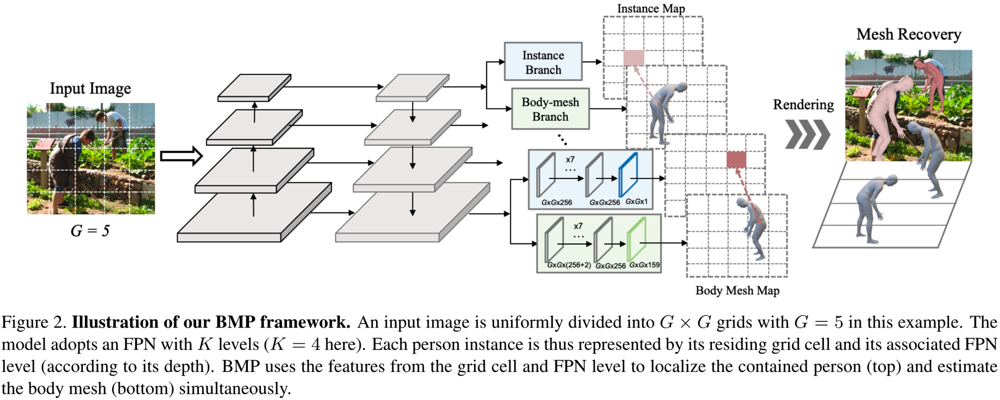

# Body Meshes as Points
Code repository for the paper:

**Body Meshes as Points**

[Jianfeng Zhang](https://jeff95.me/), [Dongdong Yu](https://jeff95.me/), [Jun Hao Liew](https://jeff95.me/), [Xuecheng Nie](https://jeff95.me/), [Jiashi Feng](https://sites.google.com/site/jshfeng/)

CVPR 2021

[[paper (coming soon)](https://jeff95.me/)] [[project page (coming soon)](https://jeff95.me/)]

### Citation
If you  find this code useful for your research, please consider citing the following paper:

    @inproceedings{zhang2021bmp,
      title       = {Body Meshes as Points},
      author      = {Zhang, Jianfeng and Yu, Dongdong and Liew, Jun Hao and Nie, Xuecheng and Feng, Jiashi},
      booktitle   = {CVPR},
      year        = {2021}
    }

### Acknowledgements
This code uses ([mmcv](https://github.com/open-mmlab/mmcv), [mmdetection](https://github.com/open-mmlab/mmdetection)) as backbone, and borrows several code from [multiperson](https://github.com/JiangWenPL/multiperson), [SPIN](https://github.com/nkolot/SPIN) and [VIBE](https://github.com/mkocabas/VIBE). We gratefully appreciate the impact these libraries had on our work. If you use our code, please consider citing the original papers as well.

 