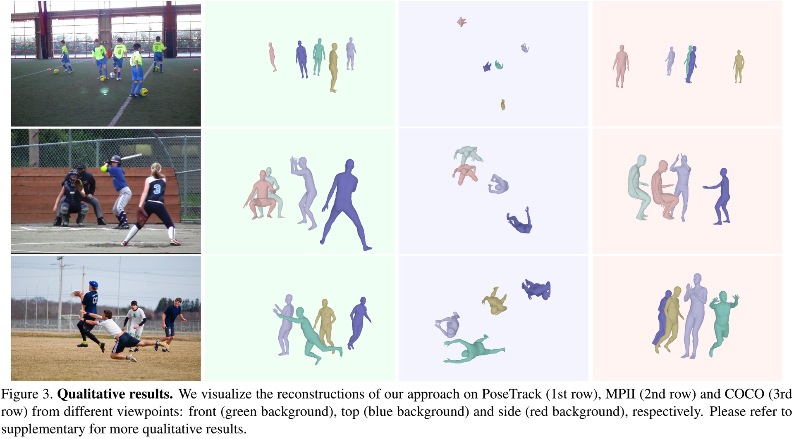

# Body Meshes as Points  
Code repository for the paper:  
**Body Meshes as Points**  
[Jianfeng Zhang](https://jeff95.me/), [Dongdong Yu](https://miracle-fmh.github.io/), [Jun Hao Liew](https://scholar.google.com.sg/citations?user=8gm-CYYAAAAJ&hl=en/), [Xuecheng Nie](https://niexc.github.io/), [Jiashi Feng](https://sites.google.com/site/jshfeng/)  
CVPR 2021  
[[paper](https://arxiv.org/pdf/2105.02467.pdf)] [[project page (coming soon)](https://jeff95.me/)]  

## Introduction
**Overview of the proposed method:**  


## Installation instructions
This codebase was adopted from early version of mmdetection, mmcv and multiperson. Users of this repo are highly recommended to
read the readme of [mmcv](./mmcv/README.rst) and [mmdetection](./mmdetection/README.md)  and [multiperson](https://github.com/JiangWenPL/multiperson/blob/master/README.md) before using this code.

To install relevant envs:
```bash
conda env create -f environment.yml
cd mmcv
python3 setup.py install
cd ../mmdetection
./compile.sh
python setup.py develop
cd ../neural_renderer
python3 setup.py install
cd ../sdf
python3 setup.py install
```

## Prepare datasets
Please follow [multiperson](https://github.com/JiangWenPL/multiperson/blob/master/DATASETS.md) for the preparation of the dataset files.

## Run training code
Please make sure you have prepared all datasets before running our training script.
The training of our model would take two phases, pretrain -> fine tuning. We prepared two configuration files under `mmdetection/configs/bmp/`.
To train our model from scratch:

```bash
cd mmdetection
# Phase 1: Pretraining
python3 tools/train.py configs/bmp/pretrain.py --create_dummy
while true:
do
    python3 tools/train.py configs/bmp/pretrain.py
done
# We could move to next phase after training for 200 epoches

# Phase 2: Fine-tuning
python3 tools/train.py configs/bmp/finetune.py --load_pretrain ./work_dirs/pretrain/latest.pth
while true:
do
    python3 tools/train.py configs/bmp/finetune.py 
done
# It could be done after 50 epoches of training
```

## Run evaluation code
You could use the trained model to evaluate on Panoptic, MuPoTS-3D, Human3.6M and 3DPW.

Example usage:
```
cd mmdetection
bash scripts/eval_all.sh
```

## Run demo code
You could use the trained model for image inference by running:

```
cd mmdetection
bash scripts/demo.sh
```

**Qualitative results:**  


## Citation
If you  find this code useful for your research, please consider citing the following paper:

    @inproceedings{zhang2021bmp,
      title       = {Body Meshes as Points},
      author      = {Zhang, Jianfeng and Yu, Dongdong and Liew, Jun Hao and Nie, Xuecheng and Feng, Jiashi},
      booktitle   = {CVPR},
      year        = {2021}
    }

## Acknowledgements
This code uses ([mmcv](https://github.com/open-mmlab/mmcv), [mmdetection](https://github.com/open-mmlab/mmdetection)) as backbone, and borrows several code from [multiperson](https://github.com/JiangWenPL/multiperson), [SPIN](https://github.com/nkolot/SPIN) and [VIBE](https://github.com/mkocabas/VIBE). We gratefully appreciate the impact these libraries had on our work. If you use our code, please consider citing the original papers as well.
